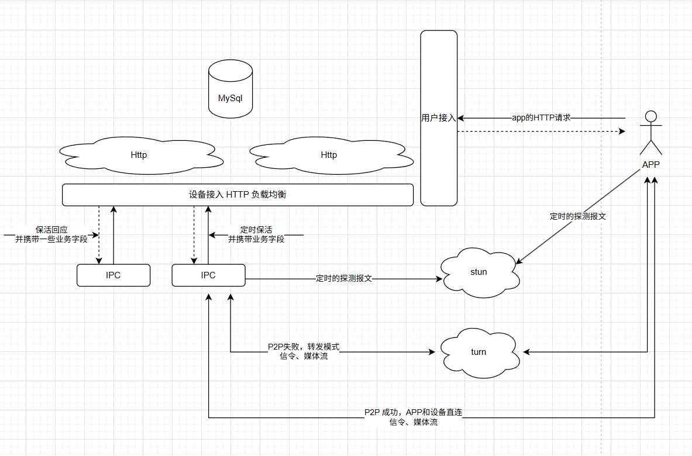

# IoT 上云架构设计文档

## 文档信息

本文档介绍个人的从业经验。
个人的经验：
- 早期从事C++的播放器开发，熟悉流媒体技术、C++的内存管理、多线程编程、网络编程等。
- 后来在游戏公司云端开发，熟悉微服务架构设计
- 现在在一家公司负责IoT设备上云架构设计，负责设计和实现基于云的IoT解决方案。设备量1000w+，不算大

其中Iot设备就是摄像机和nvr，无其他传感器。
有价值的经历就是，这家公司从云端0台设备慢慢走过来，从0设备量，到100w设备量，再到1000w设备量，公司的架构设计都在演进。
我只是把其中经历和一些决策记录下来，分享给大家。

## 目录

- [1. 引言](#1-引言)
  - [1.1 文档目的](#11-文档目的)
  - [1.2 适用范围](#12-适用范围)
  - [1.3 术语定义](#13-术语定义)
- [2. 1.0版-简单版](#2-设计背景)
  - [2.1 业务需求](#21-业务需求)
  - [2.2 技术挑战](#22-技术挑战)
  - [2.3 现有系统分析](#23-现有系统分析)

---

## 1. 引言

### 1.1 文档目的

见 文档信息

### 1.2 适用范围

本架构设计适用于友商公司的IoT设备上云建设，涵盖设备接入、数据处理、应用开发等环节。

### 1.3 术语定义

| 术语       | 解释说明                                 |
|------------|------------------------------------------|
| IoT        | 物联网（Internet of Things）             |
| MQTT       | 消息队列遥测传输协议                      |
| IPC         | 网络摄像机            |
| NVR         | 网络视频录像机（Network Video Recorder）|

---

## 2. 设计背景 1.0 版 - 简单版

一种简化版设计，可以快速实现且没有特别大的技术复杂度，适用早期低投入的场景。

### 2.1 业务需求

- 支持1000万台设备同时在线
- 实现设备数据的实时采集与分析
- 提供设备远程监控与控制功能
- 支持多租户隔离

### 2.2 技术挑战

- P2P技术
- 海量设备接入稳定性
- 人力成本: 能力、专业性、人力数量

### 2.3 现有系统分析

无，从0开始设计

### 2.4 架构设计原则

- **可靠性**：确保系统7x24小时稳定运行
- **可扩展性**：支持业务快速增长和设备规模扩展
- **安全性**：保障设备、数据和系统的安全
- **可维护性**：降低系统运维复杂度

---

### 2.5 架构概览

#### 2.5.1 总体架构图

#### 2.5.2 核心组件说明

- **设备接入层**：负责设备的身份认证、连接管理和消息转发
- **数据处理层**：对设备数据进行清洗、转换、聚合和实时分析
- **数据存储层**：存储设备元数据、历史数据和分析结果
- **业务应用层**：实现业务逻辑，提供API和服务
- **用户界面**： APP提供可视化监控和管理功能

---

### 2.6 详细架构设计

就是一个简单的HTTP服务端，使用python、c#、java语言都可以，难度并不大，不涉及太多的中间件。
性能瓶颈在于http接入层，因为http是无状态的，每次请求都需要服务器端进行处理，所以性能受到限制。
合理设计数据库表，采用分库分表。
这个架构技术难度不大

#### 2.6.1 设备接入层

#### 2.6.1.1 接入协议

仅支持HTTP协议，不支持MQTT等其他协议。

#### 2.6.1.2 设备认证与授权

使用设备的注册码进行认证和授权，注册码在设备出厂时由厂商提供，每个设备有唯一的注册码。
使用签名认证的方式，每次请求都包含设备的注册码和签名，服务器端验证签名是否正确，以确保请求的合法性。

#### 2.6.1.3 连接管理

设备定时发起http请求，服务器端响应http请求。
技术点：
- tcp监听队列长度，观察半连接队列、全连接队列是否溢出
- 定时发送http的保活间隔，如：45s一次，但需要离散发送，不能每次都在同个时间间隔发送

### 媒体流传输技术
#### P2P技术
P2P（Peer-to-Peer，点对点）技术是一种分布式网络架构，它允许网络中的节点（称为对等节点或Peers）直接相互通信和共享资源，无需依赖中央服务器。

#### 在IoT上云架构中的应用潜力

1. **设备间直接通信**：减少云端转发延迟
2. **边缘计算辅助**：本地处理数据，减轻云端压力
3. **网络自组织**：适用于无基础设施或网络不稳定场景
4. **数据分流**：降低云端带宽成本

#### CDN技术

CDN（Content Delivery Network，内容分发网络）是一种分布式网络架构，它通过在多个节点部署缓存服务器，将内容分发到用户所在的区域，以提高内容传输的速度和效率。

#### 在IoT上云架构中的应用潜力
CDN技术在IoT上云架构中具有以下应用潜力：

1. **提高效率**：CDN节点缓存了常用的内容，用户请求时可以直接从缓存中获取，而不需要通过云端服务器，从而提高了效率。
2. **支持高并发**：CDN节点分布在不同的区域，能够处理大规模的并发请求，避免了云端服务器的压力。
3. **跨平台**：CDN技术支持多种操作系统和设备，包括PC、移动设备、智能电视等，具有良好的跨平台兼容性。

#### webrtc技术

webrtc（Web Real-Time Communication）是一种基于浏览器的实时通信技术，它允许在浏览器之间直接进行音频、视频和数据传输，而无需依赖插件或第三方应用。

#### 在IoT上云架构中的应用潜力
webrtc技术在IoT上云架构中具有以下应用潜力：

1. **实时通信**：webrtc技术支持实时音频、视频和数据传输，适用于需要实时通信的场景，如视频会议、实时监控等。
2. **低延迟**：webrtc技术采用点对点通信，避免了云端转发延迟，因此具有较低的通信延迟。
3. **跨平台**：webrtc技术基于浏览器实现，因此可以在不同的操作系统和设备上运行，具有良好的跨平台兼容性。
4. **成本低**：webrtc技术无需安装插件或第三方应用，因此成本较低。

#### 总结
对于IPC/NVR设备，媒体流是非常重要的，因此如何降低成本是一个重要的考虑因素，也是首选P2P的原因。
但实际应用中，跨平台兼容性是一个非常重要的问题，比如和微信小程序的兼容性问题、和海外设备alexa\google home的兼容性问题等。

因此P2P、webrtc、cdn都是需要应用到IoT上云架构中的。

#### 决策
webrtc技术是一个非常好的选择，因为它支持实时通信、低延迟、跨平台兼容性和成本低等优势。但是它的技术实现比较复杂，特别是需要在低成本设备端实现webrtc客户端，这是一个技术难点。

因此，在考虑成本和功能的平衡后，我们选择了P2P技术作为媒体流传输方案。
在海外和alexa\google home等设备对接上，采用中转的方式在云端进行webrtc通信；
在国内微信小程序，采用云端中转的方式，使用rtmp协议进行传输。